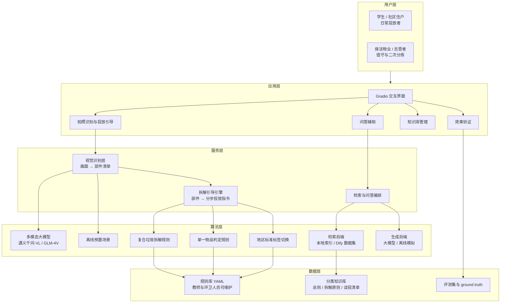
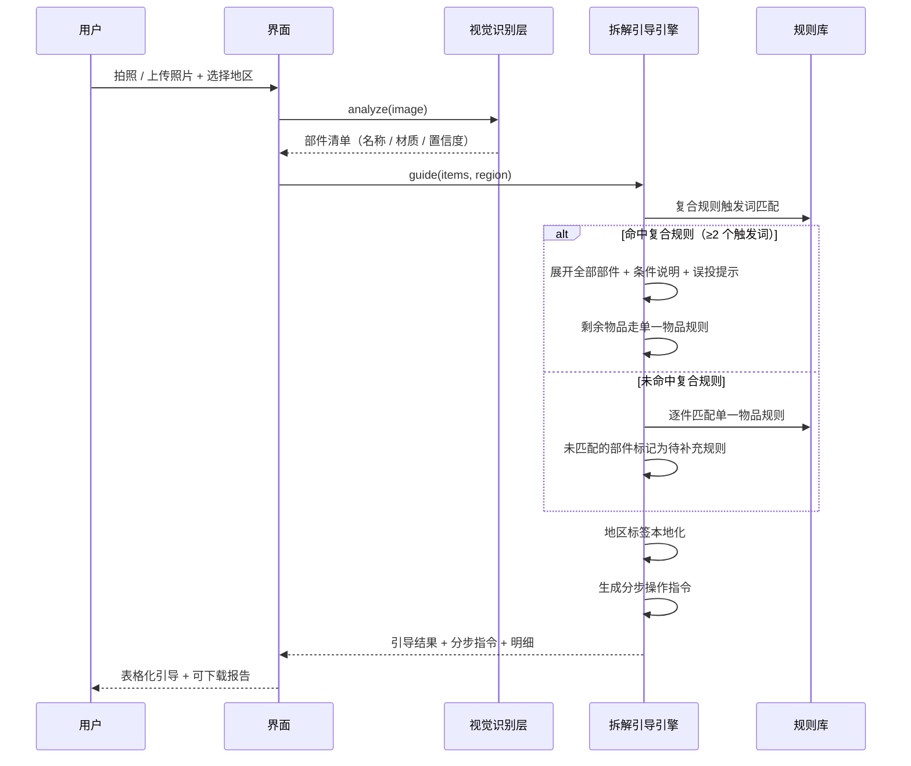
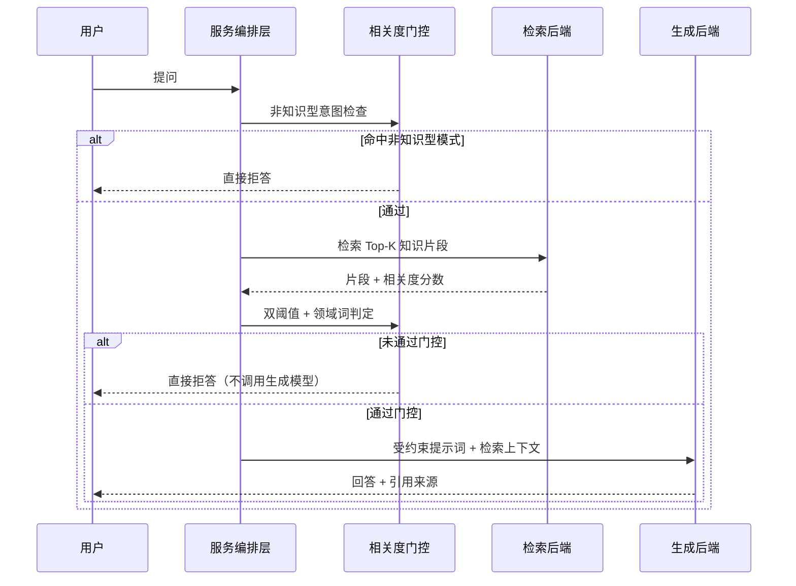

# 系统架构说明

本文件是写给方案书的**素材稿**。写方案书时把图和各层描述搬过去，
再按你的真实场景替换模块名即可。

## 一、整体架构



## 二、各层职责

| 层 | 模块 | 职责 | 对应代码 |
| --- | --- | --- | --- |
| 用户层 | — | 日常投放者、值守人员两个使用视角 | `scenes/*.yaml` 的 `users` |
| 应用层 | 交互界面 | 拍照识别、问答、知识库维护、评测触发 | `app/ui.py` |
| 服务层 | 视觉识别层 | 把照片变成结构化部件清单 | `app/vision.py` |
| 服务层 | 拆解引导引擎 | 匹配复合规则、展开部件、生成分步指令 | `app/disassembler.py` |
| 服务层 | 检索与问答编排 | 串联检索→提示词→生成→引用，含相关度门控 | `app/service.py` |
| 算法层 | 多模态模型 | 场景语义理解（"这是一杯没喝完的奶茶"） | `app/vision.py` |
| 算法层 | 规则匹配 | 触发词匹配、复合优先级、单一物品兜底 | `app/disassembler.py` |
| 算法层 | 地区标签体系 | 类别名称本地化 + 桶名简写归一 | `app/disassembler.py` |
| 数据层 | 规则库 | 8 类复合 + 20 类单品 + 4 套地区标准，YAML 外置 | `rules/waste_sorting.yaml` |
| 数据层 | 知识库 | 分类总则、拆解原则、误投清单、地区差异 | `knowledge/waste_sorting/` |
| 数据层 | 评测数据 | 拆解引导 ground truth 与问答评测集 | `eval/` |

## 三、数据流

### 拍照识别与拆解引导（核心链路）



### 问答链路（依据解答）



## 四、四个可写进方案书的技术设计点

### 1. 感知与判定分离，而不是让大模型做一切

多模态模型只负责"画面里有什么"，**不判断属于哪类垃圾**。类别判定交给规则库。

理由是类别归属有两个模型处理不好的特征：

- **依赖外部标准**：上海叫湿垃圾、北京叫厨余垃圾，同一件物品在两地归属可能不同；
- **依赖现场条件**："餐盒是否冲洗干净"是条件分支，不是分类问题。

这样设计还有一个可解释的收益：**模型识别错了只影响部件清单，类别判定不会跟着错。**

### 2. 条件化投放：把"可能有两种答案"显式写进规则

传统查询工具给单一结论，直接导致误投。本作品把条件作为规则的一等字段：

```yaml
- name: 塑料餐盒
  category: recyclable
  conditional: 油污能洗净时投可回收物；油污严重无法洗净时按其他垃圾投放
  pitfall: 本项是全场景误投率最高的判断点——很多人凭"塑料=可回收"直接投放
```

引导输出时，`conditional` 与 `pitfall` 会被单独成段展示，
确保用户看到的是"判断依据"而不是"标准答案"。

### 3. 地区标签体系与本地化回归测试

规则文本由人编写，很容易写死类别名（"投其他垃圾"）。
切换到上海口径时，如果不做本地化，输出会变成
"湿垃圾 / 其他垃圾"混用，前后矛盾，直接损害系统可信度。

处理方式：

- 类别名集中在 `regions.*.labels` 中，规则文本里的通用类别名统一替换；
- 桶名简写（"厨余桶"）也一并归一；
- 评测中设了专门的**地区标签一致性**回归项，切换上海口径后
  检查输出中是否残留"厨余垃圾 / 其他垃圾 / 厨余桶 / 其他桶"。

### 4. 规则外置，使用者可自行维护

8 类复合规则、20 类单品规则、4 套地区标准全部写在 YAML 中，
触发词、部件拆分、条件说明、误投提示都是配置项。
后勤与环保社团**不需要开发者介入**就能增删规则。

这是作品能否"长期运行"的关键——**工具必须能被使用者自己维护**。

## 五、性能与可靠性设计

| 关注点 | 措施 |
| --- | --- |
| 识别时延 | 分段计时（识别耗时在界面显示） |
| 识别失败 | 捕获异常并给出可读提示，不返回空白界面 |
| 模型未配置 | 自动降级到离线预置场景，流程不中断 |
| 模型输出非 JSON | 兼容代码块包裹与大括号提取，失败时保留原始文本排障 |
| 规则未覆盖 | 未匹配部件单独列出并给出兜底建议，不静默丢弃 |
| 规则写错 | 单个规则异常不影响其它规则与整体流程 |
| 地区切换 | 标签全量本地化 + 回归测试 |
| 可复现性 | 全部配置走 `.env`，依赖固定在 `requirements.txt` |
